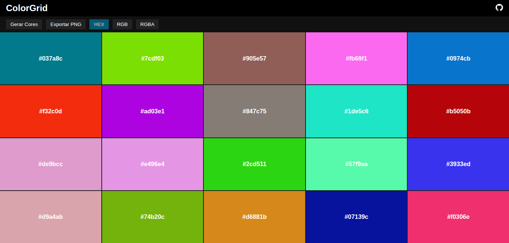

#  ColorGrid

**ColorGrid** is a 5x4 color palette generator with editable cards, format switching (HEX, RGB, RGBA), one-click copy, and PNG export.

---

## Live Demo

[Open ColorGrid](https://colorgrid.pages.dev/)

## Preview



## Features

- Generate a 5x4 grid with 20 random colors
- Edit each color directly on the card
- Switch between HEX, RGB, and RGBA without regenerating colors
- Copy any color value with one click
- Export the current palette as PNG
- Responsive and simple interface

## Technologies

- HTML5
- CSS3
- JavaScript
- Clipboard API
- Canvas API

## Project Structure

src/

├── index.html

├── css/style.css

├── js/script.js

└── images/

## How to use

1. Clone or download this repository:
   ```bash
   git clone https://github.com/AntonioCarioca/ColorGrid.git

   ```
2. Open the `index.html` file in any modern browser.

## Inspiration

This project was created as a visual tool to explore color palettes in a simple, interactive and efficient way.

## Releases

See the project releases for version history.

## Contributing

Contributions are welcome. Feel free to open an issue or submit a pull request.

## License

This project is licensed under the [MIT License](https://opensource.org/license/mit).

## Contact

If you have any suggestions, ideas or would like to contribute, please get in touch or open an issu e!
