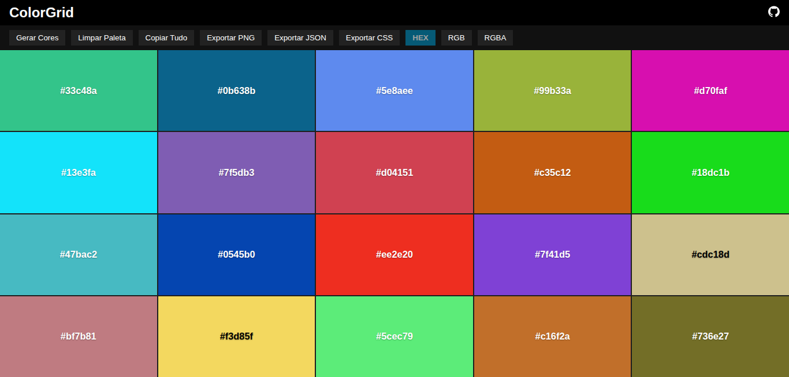

# 🎨 ColorGrid


A modern and interactive color palette generator built with pure JavaScript.

Generate beautiful color grids, customize colors, copy values, and export palettes in multiple formats.

## 🌐 Live Demo

🔗 [Access ColorGrid](https://colorgrid.pages.dev/)

## 📸 Preview



## 🚀 Features

- 🎲 Random color generation (grid layout)
- 🎯 Supports HEX, RGB, and RGBA formats
- ✏️ Edit colors directly in the grid
- 📋 Copy individual colors
- 📦 Copy all colors at once
- 🧹 Clear palette
- 🖼️ Export palette as PNG
- 📄 Export palette as JSON
- 🎨 Export palette as CSS variables
- 📱 Responsive design (mobile-friendly)
- 🎯 Automatic text contrast for better readability

## 🛠️ Technologies

- HTML5
- CSS3
- JavaScript (Vanilla)

## 📦 Installation

Clone the repository:

```bash
git clone https://github.com/AntonioCarioca/ColorGrid.git
```

Open the project:

```
cd ColorGrid
```

Run locally:

```
open index.html
```

## 🎮 Usage

1. Click "**Gerar Cores**" to generate a new palette
2. Click on a color to copy it
3. Switch between **HEX / RGB / RGBA** formats
4. Use:
   - **Limpar Paleta** to reset
   - **Copiar Tudo** to copy all colors
   - **Exportar PNG / JSON / CSS** to download
   
## 📁 Project Structure

```
ColorGrid/
├── src/
│   ├── index.html
│   ├── css/
│   ├── js/
│   └── images/
├── CHANGELOG.md
└── README.md
```

## 🧠 Versioning

This project follows **Semantic Versioning**.

See the [CHANGELOG](https://github.com/AntonioCarioca/ColorGrid/blob/main/CHANGELOG.md) for details.

## 🤝 Contributing

Contributions are welcome!

If you find a bug or have suggestions, feel free to open an issue.

## 📄 License

This project is licensed under the MIT License.

## ⭐ Support

If you like this project, give it a ⭐ on GitHub!