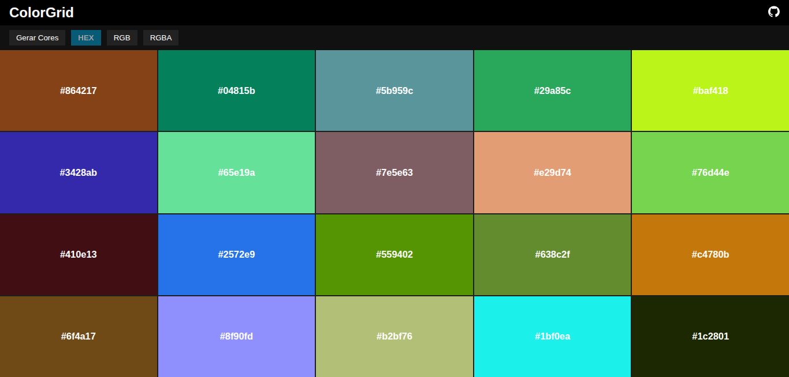

#  ColorGrid

**ColorGrid** is an 5x4 grid of customizable colors. Edit hexadecimal codes, copy with a click. Perfect for creating palettes and testing color combinations in a practical way.

---

## ✨ Features

- ✅ Editing live colors by their code value.
- ✅ Quick color copy with one click.
- ✅ Intuitive and responsive interface.
- ✅ supported color formats: HEX, RGB, RGBA.

---

## 📦 Technologies used

- HTML5
- CSS3 (grid layout + visual effects)
- JavaScript (DOM, clipboard API)

---

## 🚀 How to use

1. Clone or download this repository:
   ```bash
   git clone https://github.com/seu-usuario/colorgrid-pro.git

   ```
2. Open the `index.html` file in any modern browser.

3. Or access: [ColorGrid](https://colorgrid.pages.dev/)

## Screen Capture



## 🧠 Inspiration

This project was created as a visual tool to explore color palettes in a simple, interactive and efficient way.

## 📄 License

This project is licensed under the [MIT License](https://opensource.org/license/mit).

## 📬 Contact

If you have any suggestions, ideas or would like to contribute, please get in touch or open an issu e!
